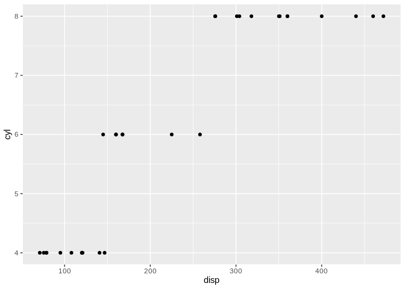

<!-- README.md is generated from README.Rmd. Please edit that file -->

# DFplyr

<!-- badges: start -->

<!-- badges: end -->

The goal of DFplyr is to enable `dplyr` and `ggplot2` support for
`S4Vectors::DataFrame` by providing the appropriate extension methods.
As row names are an important feature of many Bioconductor structures,
these are preserved where possible.

## Installation

You can install the development version from
[GitHub](https://github.com/) with:

``` r
# install.packages("devtools")
devtools::install_github("jonocarroll/DFplyr")
```

## Examples

Most `dplyr` functions are implemented. If you find any which are not,
please [file an
issue](https://github.com/jonocarroll/DFplyr/issues/new).

``` r
suppressPackageStartupMessages(
  suppressWarnings({
    library(S4Vectors)
    library(dplyr)
    library(DFplyr)
  }))
```

First create an S4Vectors DataFrame, including S4 columns if desired

``` r
library(S4Vectors)
m <- mtcars[, c("cyl", "hp", "am", "gear", "disp")]
d <- as(m, "DataFrame")
d$grX <- GenomicRanges::GRanges("chrX", IRanges::IRanges(1:32, width=10))
d$grY <- GenomicRanges::GRanges("chrY", IRanges::IRanges(1:32, width = 10))
d$nl <- IRanges::NumericList(lapply(d$gear, function(n) round(rnorm(n), 2)))
d
#> DataFrame with 32 rows and 8 columns
#>                         cyl        hp        am      gear      disp        grX
#>                   <numeric> <numeric> <numeric> <numeric> <numeric>  <GRanges>
#> Mazda RX4                 6       110         1         4       160  chrX:1-10
#> Mazda RX4 Wag             6       110         1         4       160  chrX:2-11
#> Datsun 710                4        93         1         4       108  chrX:3-12
#> Hornet 4 Drive            6       110         0         3       258  chrX:4-13
#> Hornet Sportabout         8       175         0         3       360  chrX:5-14
#> ...                     ...       ...       ...       ...       ...        ...
#> Lotus Europa              4       113         1         5      95.1 chrX:28-37
#> Ford Pantera L            8       264         1         5     351.0 chrX:29-38
#> Ferrari Dino              6       175         1         5     145.0 chrX:30-39
#> Maserati Bora             8       335         1         5     301.0 chrX:31-40
#> Volvo 142E                4       109         1         4     121.0 chrX:32-41
#>                          grY                    nl
#>                    <GRanges>         <NumericList>
#> Mazda RX4          chrY:1-10    0.55,1.19,0.91,...
#> Mazda RX4 Wag      chrY:2-11 -1.17, 0.02, 0.53,...
#> Datsun 710         chrY:3-12  0.54,-0.93, 0.37,...
#> Hornet 4 Drive     chrY:4-13      0.01, 0.07,-0.37
#> Hornet Sportabout  chrY:5-14      0.27,-0.94,-0.81
#> ...                      ...                   ...
#> Lotus Europa      chrY:28-37  0.69,-1.58,-0.05,...
#> Ford Pantera L    chrY:29-38  0.47, 0.27,-0.41,...
#> Ferrari Dino      chrY:30-39  0.95,-0.14, 1.21,...
#> Maserati Bora     chrY:31-40  2.39, 0.04,-2.02,...
#> Volvo 142E        chrY:32-41 -0.97,-0.54,-0.93,...
```

This will appear in RStudio’s environment pane as a `Formal class
DataFrame (dplyr-compatible)` when using `DFplyr`. No interference with
the actual object is required, but this helps identify that
`dplyr`-compatibility is available.

`DataFrame`s can then be used in `dplyr` calls the same as `data.frame`
or `tibble` objects. Support for working with S4 columns is enabled
provided they have appropriate functions. Adding multiple columns will
result in the new columns being created in alphabetical order

``` r
mutate(d, newvar = cyl + hp)
#> DataFrame with 32 rows and 9 columns
#>                         cyl        hp        am      gear      disp        grX
#>                   <numeric> <numeric> <numeric> <numeric> <numeric>  <GRanges>
#> Mazda RX4                 6       110         1         4       160  chrX:1-10
#> Mazda RX4 Wag             6       110         1         4       160  chrX:2-11
#> Datsun 710                4        93         1         4       108  chrX:3-12
#> Hornet 4 Drive            6       110         0         3       258  chrX:4-13
#> Hornet Sportabout         8       175         0         3       360  chrX:5-14
#> ...                     ...       ...       ...       ...       ...        ...
#> Lotus Europa              4       113         1         5      95.1 chrX:28-37
#> Ford Pantera L            8       264         1         5     351.0 chrX:29-38
#> Ferrari Dino              6       175         1         5     145.0 chrX:30-39
#> Maserati Bora             8       335         1         5     301.0 chrX:31-40
#> Volvo 142E                4       109         1         4     121.0 chrX:32-41
#>                          grY                    nl    newvar
#>                    <GRanges>         <NumericList> <numeric>
#> Mazda RX4          chrY:1-10    0.55,1.19,0.91,...       116
#> Mazda RX4 Wag      chrY:2-11 -1.17, 0.02, 0.53,...       116
#> Datsun 710         chrY:3-12  0.54,-0.93, 0.37,...        97
#> Hornet 4 Drive     chrY:4-13      0.01, 0.07,-0.37       116
#> Hornet Sportabout  chrY:5-14      0.27,-0.94,-0.81       183
#> ...                      ...                   ...       ...
#> Lotus Europa      chrY:28-37  0.69,-1.58,-0.05,...       117
#> Ford Pantera L    chrY:29-38  0.47, 0.27,-0.41,...       272
#> Ferrari Dino      chrY:30-39  0.95,-0.14, 1.21,...       181
#> Maserati Bora     chrY:31-40  2.39, 0.04,-2.02,...       343
#> Volvo 142E        chrY:32-41 -0.97,-0.54,-0.93,...       113

mutate(d, nl2 = nl * 2)
#> DataFrame with 32 rows and 9 columns
#>                         cyl        hp        am      gear      disp        grX
#>                   <numeric> <numeric> <numeric> <numeric> <numeric>  <GRanges>
#> Mazda RX4                 6       110         1         4       160  chrX:1-10
#> Mazda RX4 Wag             6       110         1         4       160  chrX:2-11
#> Datsun 710                4        93         1         4       108  chrX:3-12
#> Hornet 4 Drive            6       110         0         3       258  chrX:4-13
#> Hornet Sportabout         8       175         0         3       360  chrX:5-14
#> ...                     ...       ...       ...       ...       ...        ...
#> Lotus Europa              4       113         1         5      95.1 chrX:28-37
#> Ford Pantera L            8       264         1         5     351.0 chrX:29-38
#> Ferrari Dino              6       175         1         5     145.0 chrX:30-39
#> Maserati Bora             8       335         1         5     301.0 chrX:31-40
#> Volvo 142E                4       109         1         4     121.0 chrX:32-41
#>                          grY                    nl                   nl2
#>                    <GRanges>         <NumericList>         <NumericList>
#> Mazda RX4          chrY:1-10    0.55,1.19,0.91,...    1.10,2.38,1.82,...
#> Mazda RX4 Wag      chrY:2-11 -1.17, 0.02, 0.53,... -2.34, 0.04, 1.06,...
#> Datsun 710         chrY:3-12  0.54,-0.93, 0.37,...  1.08,-1.86, 0.74,...
#> Hornet 4 Drive     chrY:4-13      0.01, 0.07,-0.37      0.02, 0.14,-0.74
#> Hornet Sportabout  chrY:5-14      0.27,-0.94,-0.81      0.54,-1.88,-1.62
#> ...                      ...                   ...                   ...
#> Lotus Europa      chrY:28-37  0.69,-1.58,-0.05,...  1.38,-3.16,-0.10,...
#> Ford Pantera L    chrY:29-38  0.47, 0.27,-0.41,...  0.94, 0.54,-0.82,...
#> Ferrari Dino      chrY:30-39  0.95,-0.14, 1.21,...  1.90,-0.28, 2.42,...
#> Maserati Bora     chrY:31-40  2.39, 0.04,-2.02,...  4.78, 0.08,-4.04,...
#> Volvo 142E        chrY:32-41 -0.97,-0.54,-0.93,... -1.94,-1.08,-1.86,...

mutate(d, length_nl = lengths(nl))
#> DataFrame with 32 rows and 9 columns
#>                         cyl        hp        am      gear      disp        grX
#>                   <numeric> <numeric> <numeric> <numeric> <numeric>  <GRanges>
#> Mazda RX4                 6       110         1         4       160  chrX:1-10
#> Mazda RX4 Wag             6       110         1         4       160  chrX:2-11
#> Datsun 710                4        93         1         4       108  chrX:3-12
#> Hornet 4 Drive            6       110         0         3       258  chrX:4-13
#> Hornet Sportabout         8       175         0         3       360  chrX:5-14
#> ...                     ...       ...       ...       ...       ...        ...
#> Lotus Europa              4       113         1         5      95.1 chrX:28-37
#> Ford Pantera L            8       264         1         5     351.0 chrX:29-38
#> Ferrari Dino              6       175         1         5     145.0 chrX:30-39
#> Maserati Bora             8       335         1         5     301.0 chrX:31-40
#> Volvo 142E                4       109         1         4     121.0 chrX:32-41
#>                          grY                    nl length_nl
#>                    <GRanges>         <NumericList> <integer>
#> Mazda RX4          chrY:1-10    0.55,1.19,0.91,...         4
#> Mazda RX4 Wag      chrY:2-11 -1.17, 0.02, 0.53,...         4
#> Datsun 710         chrY:3-12  0.54,-0.93, 0.37,...         4
#> Hornet 4 Drive     chrY:4-13      0.01, 0.07,-0.37         3
#> Hornet Sportabout  chrY:5-14      0.27,-0.94,-0.81         3
#> ...                      ...                   ...       ...
#> Lotus Europa      chrY:28-37  0.69,-1.58,-0.05,...         5
#> Ford Pantera L    chrY:29-38  0.47, 0.27,-0.41,...         5
#> Ferrari Dino      chrY:30-39  0.95,-0.14, 1.21,...         5
#> Maserati Bora     chrY:31-40  2.39, 0.04,-2.02,...         5
#> Volvo 142E        chrY:32-41 -0.97,-0.54,-0.93,...         4

mutate(d, 
       chr = GenomeInfoDb::seqnames(grX), 
       strand_X = BiocGenerics::strand(grX), 
       end_X = BiocGenerics::end(grX))
#> DataFrame with 32 rows and 11 columns
#>                         cyl        hp        am      gear      disp        grX
#>                   <numeric> <numeric> <numeric> <numeric> <numeric>  <GRanges>
#> Mazda RX4                 6       110         1         4       160  chrX:1-10
#> Mazda RX4 Wag             6       110         1         4       160  chrX:2-11
#> Datsun 710                4        93         1         4       108  chrX:3-12
#> Hornet 4 Drive            6       110         0         3       258  chrX:4-13
#> Hornet Sportabout         8       175         0         3       360  chrX:5-14
#> ...                     ...       ...       ...       ...       ...        ...
#> Lotus Europa              4       113         1         5      95.1 chrX:28-37
#> Ford Pantera L            8       264         1         5     351.0 chrX:29-38
#> Ferrari Dino              6       175         1         5     145.0 chrX:30-39
#> Maserati Bora             8       335         1         5     301.0 chrX:31-40
#> Volvo 142E                4       109         1         4     121.0 chrX:32-41
#>                          grY                    nl   chr     end_X strand_X
#>                    <GRanges>         <NumericList> <Rle> <integer>    <Rle>
#> Mazda RX4          chrY:1-10    0.55,1.19,0.91,...  chrX        10        *
#> Mazda RX4 Wag      chrY:2-11 -1.17, 0.02, 0.53,...  chrX        11        *
#> Datsun 710         chrY:3-12  0.54,-0.93, 0.37,...  chrX        12        *
#> Hornet 4 Drive     chrY:4-13      0.01, 0.07,-0.37  chrX        13        *
#> Hornet Sportabout  chrY:5-14      0.27,-0.94,-0.81  chrX        14        *
#> ...                      ...                   ...   ...       ...      ...
#> Lotus Europa      chrY:28-37  0.69,-1.58,-0.05,...  chrX        37        *
#> Ford Pantera L    chrY:29-38  0.47, 0.27,-0.41,...  chrX        38        *
#> Ferrari Dino      chrY:30-39  0.95,-0.14, 1.21,...  chrX        39        *
#> Maserati Bora     chrY:31-40  2.39, 0.04,-2.02,...  chrX        40        *
#> Volvo 142E        chrY:32-41 -0.97,-0.54,-0.93,...  chrX        41        *
```

the object returned remains a standard `DataFrame`, and further calls
can be piped with `%>%`

``` r
mutate(d, newvar = cyl + hp) %>%
  pull(newvar)
#>  [1] 116 116  97 116 183 111 253  66  99 129 129 188 188 188 213 223 238  70  56
#> [20]  69 101 158 158 253 183  70  95 117 272 181 343 113
```

Some of the variants of the `dplyr` verbs also work

``` r
mutate_if(d, is.numeric, ~.^2)
#> DataFrame with 32 rows and 8 columns
#>                         cyl        hp        am      gear      disp        grX
#>                   <numeric> <numeric> <numeric> <numeric> <numeric>  <GRanges>
#> Mazda RX4                36     12100         1        16     25600  chrX:1-10
#> Mazda RX4 Wag            36     12100         1        16     25600  chrX:2-11
#> Datsun 710               16      8649         1        16     11664  chrX:3-12
#> Hornet 4 Drive           36     12100         0         9     66564  chrX:4-13
#> Hornet Sportabout        64     30625         0         9    129600  chrX:5-14
#> ...                     ...       ...       ...       ...       ...        ...
#> Lotus Europa             16     12769         1        25   9044.01 chrX:28-37
#> Ford Pantera L           64     69696         1        25 123201.00 chrX:29-38
#> Ferrari Dino             36     30625         1        25  21025.00 chrX:30-39
#> Maserati Bora            64    112225         1        25  90601.00 chrX:31-40
#> Volvo 142E               16     11881         1        16  14641.00 chrX:32-41
#>                          grY                    nl
#>                    <GRanges>         <NumericList>
#> Mazda RX4          chrY:1-10    0.55,1.19,0.91,...
#> Mazda RX4 Wag      chrY:2-11 -1.17, 0.02, 0.53,...
#> Datsun 710         chrY:3-12  0.54,-0.93, 0.37,...
#> Hornet 4 Drive     chrY:4-13      0.01, 0.07,-0.37
#> Hornet Sportabout  chrY:5-14      0.27,-0.94,-0.81
#> ...                      ...                   ...
#> Lotus Europa      chrY:28-37  0.69,-1.58,-0.05,...
#> Ford Pantera L    chrY:29-38  0.47, 0.27,-0.41,...
#> Ferrari Dino      chrY:30-39  0.95,-0.14, 1.21,...
#> Maserati Bora     chrY:31-40  2.39, 0.04,-2.02,...
#> Volvo 142E        chrY:32-41 -0.97,-0.54,-0.93,...

mutate_if(d, ~inherits(., "GRanges"), BiocGenerics::start)
#> DataFrame with 32 rows and 8 columns
#>                         cyl        hp        am      gear      disp       grX
#>                   <numeric> <numeric> <numeric> <numeric> <numeric> <integer>
#> Mazda RX4                 6       110         1         4       160         1
#> Mazda RX4 Wag             6       110         1         4       160         2
#> Datsun 710                4        93         1         4       108         3
#> Hornet 4 Drive            6       110         0         3       258         4
#> Hornet Sportabout         8       175         0         3       360         5
#> ...                     ...       ...       ...       ...       ...       ...
#> Lotus Europa              4       113         1         5      95.1        28
#> Ford Pantera L            8       264         1         5     351.0        29
#> Ferrari Dino              6       175         1         5     145.0        30
#> Maserati Bora             8       335         1         5     301.0        31
#> Volvo 142E                4       109         1         4     121.0        32
#>                         grY                    nl
#>                   <integer>         <NumericList>
#> Mazda RX4                 1    0.55,1.19,0.91,...
#> Mazda RX4 Wag             2 -1.17, 0.02, 0.53,...
#> Datsun 710                3  0.54,-0.93, 0.37,...
#> Hornet 4 Drive            4      0.01, 0.07,-0.37
#> Hornet Sportabout         5      0.27,-0.94,-0.81
#> ...                     ...                   ...
#> Lotus Europa             28  0.69,-1.58,-0.05,...
#> Ford Pantera L           29  0.47, 0.27,-0.41,...
#> Ferrari Dino             30  0.95,-0.14, 1.21,...
#> Maserati Bora            31  2.39, 0.04,-2.02,...
#> Volvo 142E               32 -0.97,-0.54,-0.93,...
```

Use of `tidyselect` helpers is limited to within `dplyr::vars()` calls
and using the `_at` variants

``` r
mutate_at(d, vars(starts_with("c")), ~.^2)
#> DataFrame with 32 rows and 8 columns
#>                         cyl        hp        am      gear      disp        grX
#>                   <numeric> <numeric> <numeric> <numeric> <numeric>  <GRanges>
#> Mazda RX4                36       110         1         4       160  chrX:1-10
#> Mazda RX4 Wag            36       110         1         4       160  chrX:2-11
#> Datsun 710               16        93         1         4       108  chrX:3-12
#> Hornet 4 Drive           36       110         0         3       258  chrX:4-13
#> Hornet Sportabout        64       175         0         3       360  chrX:5-14
#> ...                     ...       ...       ...       ...       ...        ...
#> Lotus Europa             16       113         1         5      95.1 chrX:28-37
#> Ford Pantera L           64       264         1         5     351.0 chrX:29-38
#> Ferrari Dino             36       175         1         5     145.0 chrX:30-39
#> Maserati Bora            64       335         1         5     301.0 chrX:31-40
#> Volvo 142E               16       109         1         4     121.0 chrX:32-41
#>                          grY                    nl
#>                    <GRanges>         <NumericList>
#> Mazda RX4          chrY:1-10    0.55,1.19,0.91,...
#> Mazda RX4 Wag      chrY:2-11 -1.17, 0.02, 0.53,...
#> Datsun 710         chrY:3-12  0.54,-0.93, 0.37,...
#> Hornet 4 Drive     chrY:4-13      0.01, 0.07,-0.37
#> Hornet Sportabout  chrY:5-14      0.27,-0.94,-0.81
#> ...                      ...                   ...
#> Lotus Europa      chrY:28-37  0.69,-1.58,-0.05,...
#> Ford Pantera L    chrY:29-38  0.47, 0.27,-0.41,...
#> Ferrari Dino      chrY:30-39  0.95,-0.14, 1.21,...
#> Maserati Bora     chrY:31-40  2.39, 0.04,-2.02,...
#> Volvo 142E        chrY:32-41 -0.97,-0.54,-0.93,...

select_at(d, vars(starts_with("gr")))
#> DataFrame with 32 rows and 2 columns
#>                          grX        grY
#>                    <GRanges>  <GRanges>
#> Mazda RX4          chrX:1-10  chrY:1-10
#> Mazda RX4 Wag      chrX:2-11  chrY:2-11
#> Datsun 710         chrX:3-12  chrY:3-12
#> Hornet 4 Drive     chrX:4-13  chrY:4-13
#> Hornet Sportabout  chrX:5-14  chrY:5-14
#> ...                      ...        ...
#> Lotus Europa      chrX:28-37 chrY:28-37
#> Ford Pantera L    chrX:29-38 chrY:29-38
#> Ferrari Dino      chrX:30-39 chrY:30-39
#> Maserati Bora     chrX:31-40 chrY:31-40
#> Volvo 142E        chrX:32-41 chrY:32-41
```

Importantly, grouped operations are supported. `DataFrame` does not
natively support groups (the same way that `data.frame` does not) so
these are implemented specifically for `DFplyr`

``` r
group_by(d, cyl, am)
#> DataFrame with 32 rows and 8 columns
#> Groups:  cyl, am 
#>                         cyl        hp        am      gear      disp        grX
#>                   <numeric> <numeric> <numeric> <numeric> <numeric>  <GRanges>
#> Mazda RX4                 6       110         1         4       160  chrX:1-10
#> Mazda RX4 Wag             6       110         1         4       160  chrX:2-11
#> Datsun 710                4        93         1         4       108  chrX:3-12
#> Hornet 4 Drive            6       110         0         3       258  chrX:4-13
#> Hornet Sportabout         8       175         0         3       360  chrX:5-14
#> ...                     ...       ...       ...       ...       ...        ...
#> Lotus Europa              4       113         1         5      95.1 chrX:28-37
#> Ford Pantera L            8       264         1         5     351.0 chrX:29-38
#> Ferrari Dino              6       175         1         5     145.0 chrX:30-39
#> Maserati Bora             8       335         1         5     301.0 chrX:31-40
#> Volvo 142E                4       109         1         4     121.0 chrX:32-41
#>                          grY                    nl
#>                    <GRanges>         <NumericList>
#> Mazda RX4          chrY:1-10    0.55,1.19,0.91,...
#> Mazda RX4 Wag      chrY:2-11 -1.17, 0.02, 0.53,...
#> Datsun 710         chrY:3-12  0.54,-0.93, 0.37,...
#> Hornet 4 Drive     chrY:4-13      0.01, 0.07,-0.37
#> Hornet Sportabout  chrY:5-14      0.27,-0.94,-0.81
#> ...                      ...                   ...
#> Lotus Europa      chrY:28-37  0.69,-1.58,-0.05,...
#> Ford Pantera L    chrY:29-38  0.47, 0.27,-0.41,...
#> Ferrari Dino      chrY:30-39  0.95,-0.14, 1.21,...
#> Maserati Bora     chrY:31-40  2.39, 0.04,-2.02,...
#> Volvo 142E        chrY:32-41 -0.97,-0.54,-0.93,...

# group_by(d, cyl) %>% 
#   top_n(1, disp)
```

Other verbs are similiarly implemented, and preserve row names where
possible

``` r
select(d, am, cyl)
#> DataFrame with 32 rows and 2 columns
#>                          am       cyl
#>                   <numeric> <numeric>
#> Mazda RX4                 1         6
#> Mazda RX4 Wag             1         6
#> Datsun 710                1         4
#> Hornet 4 Drive            0         6
#> Hornet Sportabout         0         8
#> ...                     ...       ...
#> Lotus Europa              1         4
#> Ford Pantera L            1         8
#> Ferrari Dino              1         6
#> Maserati Bora             1         8
#> Volvo 142E                1         4

select(d, am, cyl) %>%
  DFplyr::rename(foo = am)
#> DataFrame with 32 rows and 2 columns
#>                         foo       cyl
#>                   <numeric> <numeric>
#> Mazda RX4                 1         6
#> Mazda RX4 Wag             1         6
#> Datsun 710                1         4
#> Hornet 4 Drive            0         6
#> Hornet Sportabout         0         8
#> ...                     ...       ...
#> Lotus Europa              1         4
#> Ford Pantera L            1         8
#> Ferrari Dino              1         6
#> Maserati Bora             1         8
#> Volvo 142E                1         4

arrange(d, desc(hp))
#> DataFrame with 32 rows and 8 columns
#>                         cyl        hp        am      gear      disp        grX
#>                   <numeric> <numeric> <numeric> <numeric> <numeric>  <GRanges>
#> Maserati Bora             8       335         1         5       301 chrX:31-40
#> Ford Pantera L            8       264         1         5       351 chrX:29-38
#> Duster 360                8       245         0         3       360  chrX:7-16
#> Camaro Z28                8       245         0         3       350 chrX:24-33
#> Chrysler Imperial         8       230         0         3       440 chrX:17-26
#> ...                     ...       ...       ...       ...       ...        ...
#> Fiat 128                  4        66         1         4      78.7 chrX:18-27
#> Fiat X1-9                 4        66         1         4      79.0 chrX:26-35
#> Toyota Corolla            4        65         1         4      71.1 chrX:20-29
#> Merc 240D                 4        62         0         4     146.7  chrX:8-17
#> Honda Civic               4        52         1         4      75.7 chrX:19-28
#>                          grY                    nl
#>                    <GRanges>         <NumericList>
#> Maserati Bora     chrY:31-40  2.39, 0.04,-2.02,...
#> Ford Pantera L    chrY:29-38  0.47, 0.27,-0.41,...
#> Duster 360         chrY:7-16      1.28,-1.67, 0.31
#> Camaro Z28        chrY:24-33      0.82,-1.24,-0.06
#> Chrysler Imperial chrY:17-26      0.23, 0.07,-0.72
#> ...                      ...                   ...
#> Fiat 128          chrY:18-27 -0.26, 0.83,-0.09,...
#> Fiat X1-9         chrY:26-35 -0.75, 0.73,-1.16,...
#> Toyota Corolla    chrY:20-29 -0.80, 0.58,-0.51,...
#> Merc 240D          chrY:8-17  1.26, 1.12,-1.27,...
#> Honda Civic       chrY:19-28    1.50,0.84,0.42,...

filter(d, am == 0) 
#> DataFrame with 19 rows and 8 columns
#>                         cyl        hp        am      gear      disp        grX
#>                   <numeric> <numeric> <numeric> <numeric> <numeric>  <GRanges>
#> Hornet 4 Drive            6       110         0         3     258.0  chrX:4-13
#> Hornet Sportabout         8       175         0         3     360.0  chrX:5-14
#> Valiant                   6       105         0         3     225.0  chrX:6-15
#> Duster 360                8       245         0         3     360.0  chrX:7-16
#> Merc 240D                 4        62         0         4     146.7  chrX:8-17
#> ...                     ...       ...       ...       ...       ...        ...
#> Toyota Corona             4        97         0         3     120.1 chrX:21-30
#> Dodge Challenger          8       150         0         3     318.0 chrX:22-31
#> AMC Javelin               8       150         0         3     304.0 chrX:23-32
#> Camaro Z28                8       245         0         3     350.0 chrX:24-33
#> Pontiac Firebird          8       175         0         3     400.0 chrX:25-34
#>                          grY                    nl
#>                    <GRanges>         <NumericList>
#> Hornet 4 Drive     chrY:4-13      0.01, 0.07,-0.37
#> Hornet Sportabout  chrY:5-14      0.27,-0.94,-0.81
#> Valiant            chrY:6-15      0.81,-0.06, 0.15
#> Duster 360         chrY:7-16      1.28,-1.67, 0.31
#> Merc 240D          chrY:8-17  1.26, 1.12,-1.27,...
#> ...                      ...                   ...
#> Toyota Corona     chrY:21-30     -0.79,-0.51, 0.51
#> Dodge Challenger  chrY:22-31      0.37,-0.07,-0.21
#> AMC Javelin       chrY:23-32     -0.86, 1.21,-1.37
#> Camaro Z28        chrY:24-33      0.82,-1.24,-0.06
#> Pontiac Firebird  chrY:25-34     -1.34, 0.41,-0.89

slice(d, 3:6)
#> DataFrame with 4 rows and 8 columns
#>                         cyl        hp        am      gear      disp       grX
#>                   <numeric> <numeric> <numeric> <numeric> <numeric> <GRanges>
#> Datsun 710                4        93         1         4       108 chrX:3-12
#> Hornet 4 Drive            6       110         0         3       258 chrX:4-13
#> Hornet Sportabout         8       175         0         3       360 chrX:5-14
#> Valiant                   6       105         0         3       225 chrX:6-15
#>                         grY                    nl
#>                   <GRanges>         <NumericList>
#> Datsun 710        chrY:3-12  0.54,-0.93, 0.37,...
#> Hornet 4 Drive    chrY:4-13      0.01, 0.07,-0.37
#> Hornet Sportabout chrY:5-14      0.27,-0.94,-0.81
#> Valiant           chrY:6-15      0.81,-0.06, 0.15

# dd <- rbind(data.frame(d[1, ], row.names = "MyCar"), d)
# dd
```

Row names are not preserved when there may be duplicates or they don’t
make sense, otherwise the first label (according to the current
de-duplication method, in the case of `distinct`, this is via
`BiocGenerics::duplicated`). This may have complications for S4 columns.

``` r
distinct(d)
#> DataFrame with 32 rows and 8 columns
#>                         cyl        hp        am      gear      disp        grX
#>                   <numeric> <numeric> <numeric> <numeric> <numeric>  <GRanges>
#> Mazda RX4                 6       110         1         4       160  chrX:1-10
#> Mazda RX4 Wag             6       110         1         4       160  chrX:2-11
#> Datsun 710                4        93         1         4       108  chrX:3-12
#> Hornet 4 Drive            6       110         0         3       258  chrX:4-13
#> Hornet Sportabout         8       175         0         3       360  chrX:5-14
#> ...                     ...       ...       ...       ...       ...        ...
#> Lotus Europa              4       113         1         5      95.1 chrX:28-37
#> Ford Pantera L            8       264         1         5     351.0 chrX:29-38
#> Ferrari Dino              6       175         1         5     145.0 chrX:30-39
#> Maserati Bora             8       335         1         5     301.0 chrX:31-40
#> Volvo 142E                4       109         1         4     121.0 chrX:32-41
#>                          grY                    nl
#>                    <GRanges>         <NumericList>
#> Mazda RX4          chrY:1-10    0.55,1.19,0.91,...
#> Mazda RX4 Wag      chrY:2-11 -1.17, 0.02, 0.53,...
#> Datsun 710         chrY:3-12  0.54,-0.93, 0.37,...
#> Hornet 4 Drive     chrY:4-13      0.01, 0.07,-0.37
#> Hornet Sportabout  chrY:5-14      0.27,-0.94,-0.81
#> ...                      ...                   ...
#> Lotus Europa      chrY:28-37  0.69,-1.58,-0.05,...
#> Ford Pantera L    chrY:29-38  0.47, 0.27,-0.41,...
#> Ferrari Dino      chrY:30-39  0.95,-0.14, 1.21,...
#> Maserati Bora     chrY:31-40  2.39, 0.04,-2.02,...
#> Volvo 142E        chrY:32-41 -0.97,-0.54,-0.93,...

group_by(d, cyl, am) %>%
  tally(gear)
#> DataFrame with 6 rows and 3 columns
#>         cyl        am         n
#>   <numeric> <numeric> <numeric>
#> 1         4         0        11
#> 2         4         1        34
#> 3         6         0        14
#> 4         6         1        13
#> 5         8         0        36
#> 6         8         1        10

count(d, gear, am, cyl)
#> DataFrame with 10 rows and 4 columns
#>        gear    am   cyl         n
#>    <factor> <Rle> <Rle> <integer>
#> 1         3     0     4         1
#> 2         3     0     6         2
#> 3         3     0     8        12
#> 4         4     0     4         2
#> 5         4     0     6         2
#> 6         4     1     4         6
#> 7         4     1     6         2
#> 8         5     1     4         2
#> 9         5     1     6         1
#> 10        5     1     8         2
```

`ggplot2` support is also enabled

``` r
library(ggplot2)
ggplot(d, aes(disp, cyl)) + geom_point()
```



## Implementation

Most of the `dplyr` verbs for `DataFrame`s are implmented by first
converting to `tibble`, performing the verb operation, then converting
back to `DataFrame`. Care has been taken to retain groups and row names
through these operations, but this may introduce some complications. If
you spot any, please [file an
issue](https://github.com/jonocarroll/DFplyr/issues/new).
